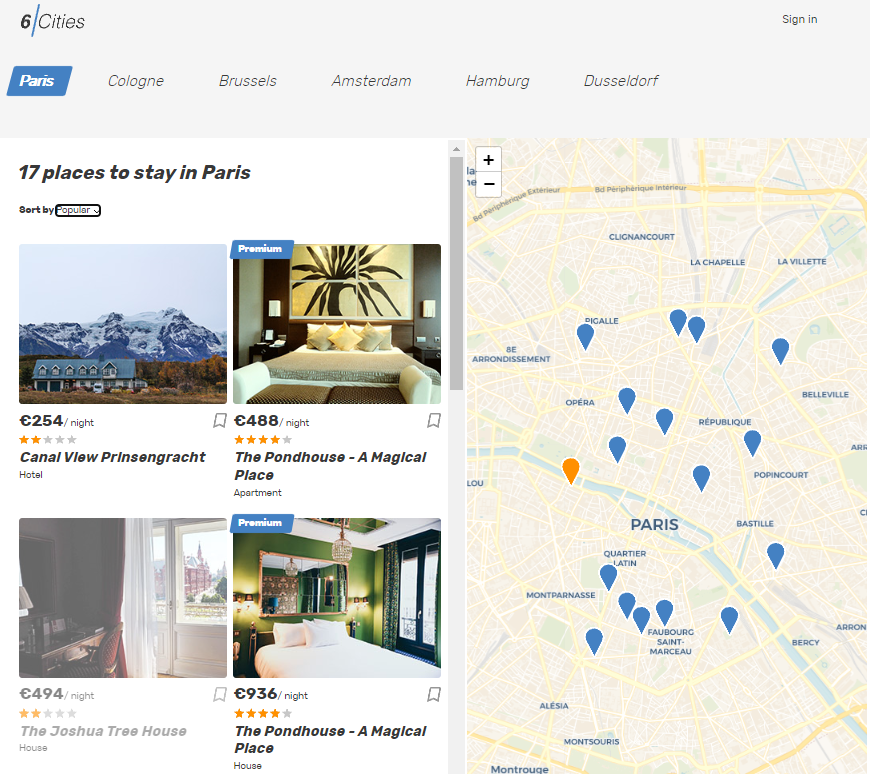

# Личный проект «Шесть городов»

- Студент: [Павел Ряполов](https://up.htmlacademy.ru/react/9/user/1217543).
- Наставник: [Игорь Казанцев](https://htmlacademy.ru/profile/id572311).

---

### О проекте

Проект предназначен для поиска объявлений об аренде в шести городах Европы.

Стэк: TypeScript, React (Hooks), Redux ToolKit, Jest

#### Главная страница

#### Страница авторизации

#### Страница объявления

#### Форма комментариев

---

Репозиторий создан для обучения на профессиональном онлайн‑курсе «[React. Разработка сложных клиентских приложений](https://htmlacademy.ru/intensive/react)» от [HTML Academy](https://htmlacademy.ru).
